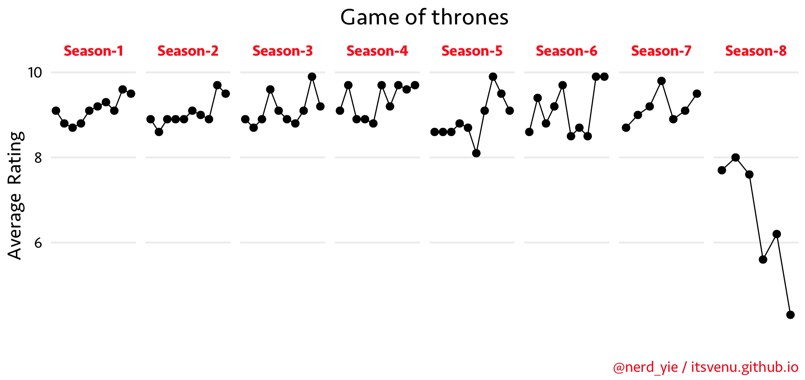
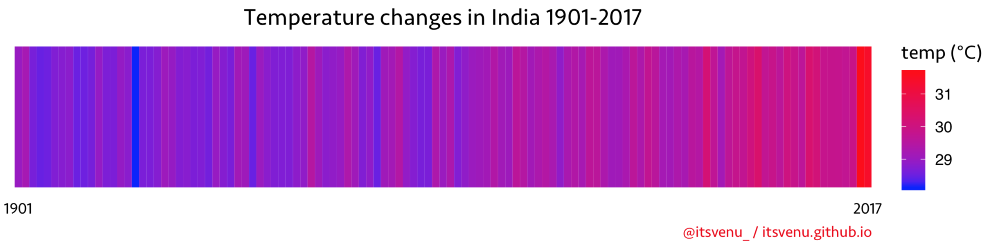

Associated blog posts of projects in this repo.

### Machine learning

* DNN - [release blog-post soon]

* BreastCancer_RandomForest - [A deep dive into 'Forests'](https://itsvenu.github.io/post/brca-random-forests/)

### Data science

* COVID-19 - [COVID-19 - An exploratory data analysis](https://itsvenu.github.io/post/covid-19/)

* Biostars - [Bioinformatics & Biostars QA forum](https://itsvenu.github.io/post/bioinformatics-biostars/) & [Evolution of Biostars](https://www.biostars.org/p/365738/)

* GoogleLocationHistoty - [Google and my travel history](https://itsvenu.github.io/post/travel-history/)

* WomenInScienceDay - [Shine and let shine!](https://itsvenu.github.io/post/women-in-science/)

* cb-challenge - Solutions implemented in R and python for some programming challenegs

### DataViz

* GOT Ratings - Game Of Thrones rating, data collected from IMDB

* India_temperature - data collected [from kaggle](https://www.kaggle.com/venky73/temperatures-of-india/version/1)

